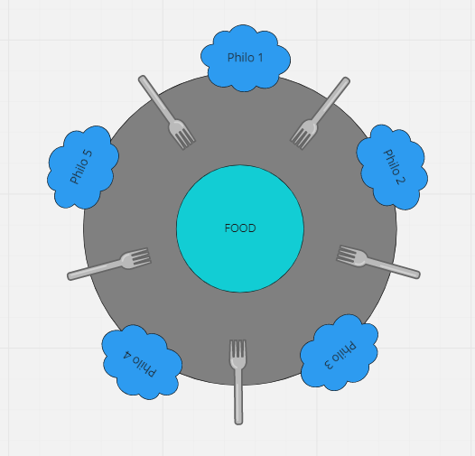
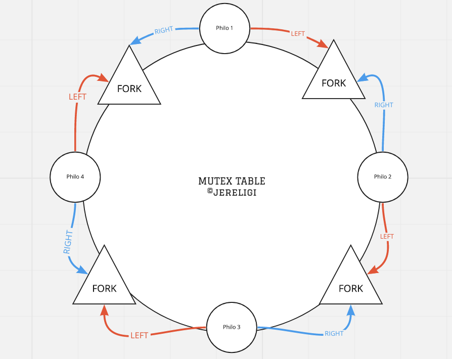

<h1 align="center">
	42cursus' Philosophers
 </h1>
 
  [](https://github.com/nandajfa/philosophers/blob/main/LICENSE)
 
 
 ### 🗣️ About

> _I never thought philosophy would be so deadly_

#### 

In this project, you will learn the basics of threading a process. You will see how to create threads and you will discover mutexes.

---

Several philosophers are sitting at a round table doing one of three things: eating, thinking, or sleeping. While eating, they are not thinking or sleeping, while sleeping, they are not eating or thinking and of course, while thinking, they are not eating or sleeping. The philosophers sit at a circular table with a large bowl of spaghetti in the center. There are some forks on the table, it is assumed that a philosopher must eat with two forks, one for each hand. The philosophers must never be starving and every philosofer needs to eat. Philosophers don’t speak with each other and don’t know when another philosopher is about to die. Each time a philosopher has finished eating, he will drop his forks and start sleeping. When a philosopher is done sleeping, he will start thinking. The simulation stops when a philosopher dies.

---

### Index

You're sections headers will be used to reference location of destination.

- [Scheme :twisted_rightwards_arrows:](#scheme)
- [Allowed Functions :white_check_mark:](#allowed-functions)
- [How To Use 📦](#how-to-use)
- [Arguments ✏️](#arguments)
- [References 📌](#references)
- [Skills 📄](#skills)
- [Author Info  ✒️](#author)

### Scheme




---

### Allowed Functions

- **printf** | **malloc** | **free** | **write**
- **memset** = [Copies the character c.](https://www.tutorialspoint.com/c_standard_library/c_function_memset.htm)
- **usleep** = [Suspend execution for microsecond intervals.](https://man7.org/linux/man-pages/man3/usleep.3.html)
- **gettimeofday** = [Get / set time.](https://man7.org/linux/man-pages/man2/gettimeofday.2.html)
- **pthread_create** = [Create a new thread.](https://man7.org/linux/man-pages/man3/pthread_create.3.html)
- **pthread_detach** = [Detach a thread.](https://man7.org/linux/man-pages/man3/pthread_detach.3.html)
- **pthread_join** = [Join with a terminated thread.](https://man7.org/linux/man-pages/man3/pthread_join.3.html)
- **pthread_mutex_init** = [Initializes a mutex with the specified attributes for use.](https://www.ibm.com/docs/en/i/7.3?topic=ssw_ibm_i_73/apis/users_61.htm)
- **pthread_mutex_destroy** = [Destroy the mutex object referenced by mutex.](https://linux.die.net/man/3/pthread_mutex_destroyl)
- **pthread_mutex_lock** = [The mutex object referenced by mutex shall be locked .](https://linux.die.net/man/3/pthread_mutex_lock)
- **pthread_mutex_unlock** = [Releases the mutex object referenced by mutex.](https://www.ibm.com/docs/en/zos/2.1.0?topic=functions-pthread-mutex-unlock-unlock-mutex-object)

---

[Back To The Top](#index)

---

#### How To Use
> Follow the steps below
```shell

# Clone the repository
git clone https://github.com/nandajfa/philosophers.git

# Access the folder
cd philosophers/philo

# Run make to compile the program
make

# Run the program
./philo 5 800 200 200 10

# Clean output files with
make fclean

# Finish
```

---


#### Arguments

```Shell
#The program should take the following arguments:

./philo number_of_philos time_to_die time_to_eat time_to_sleep [number_of_times_each_philosopher_must_eat]

*  number_of_philosophers:
	The number of philosophers and also the number of forks.
* time_to_die (in milliseconds): 
	If a philosopher didn’t start eating time_to_die milliseconds since the beginning of their last meal or the beginning of the simulation.
* time_to_eat (in milliseconds): 
	The time it takes for a philosopher to eat. During that time, they will need to hold two forks.
* time_to_sleep (in milliseconds): 
	The time a philosopher will spend sleeping.
* number_of_times_each_philosopher_must_eat (optional argument):
	The number of meals each philosopher has to eat.
	If unset, the simulation stops when a philosopher dies.

```

[Back To The Top](#index)

---
#### References

 * [Unix Threads in C -playlist](https://www.youtube.com/watch?v=d9s_d28yJq0&list=PLfqABt5AS4FmuQf70psXrsMLEDQXNkLq2)
 * [Threads questions and answers by Joyce Macksuele](https://www.notion.so/Philosophers-2b872948598e4f0cba91c66d8b5ba821)
 * [Dining Philosophers Problem with Solution](https://www.youtube.com/watch?v=NbwbQQB7xNQ)
 * [Microsecond to second](https://www.youtube.com/watch?v=DoYXn3nd0Ws)
 * [An Application of Pthreads and Mutexes](http://files.kipr.org/gcer/2009/proceedings/Myers_ApplicationPthreads.pdf)
 * [Philosophers visualizer](https://nafuka11.github.io/philosophers-visualizer/)
 * [How to create and join threads in C (pthreads) - Jacob Sorber](https://www.youtube.com/watch?v=uA8X5zNOGw8&t=2s)
 * [Threads em C](https://homepages.dcc.ufmg.br/~coutinho/pthreads/ProgramandoComThreads.pdf)

---
#### Skills

* Rigor
* Unix
* Imperative programming

#### Author

* Jessica Fernanda 👋 [See my linkedin](https://www.linkedin.com/in/jessica-fernanda-106651205) <br />

[Back To The Top](#index)